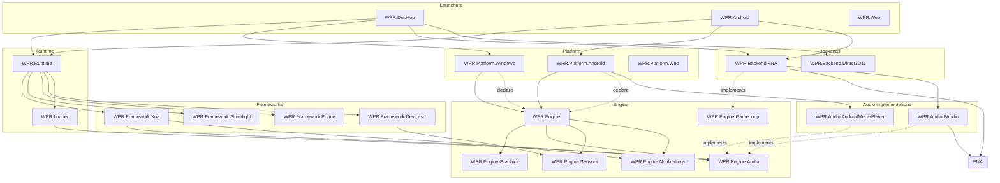

# WPR Architecture Migration Plan (ADR) — outstanding work

**Status:** In flight · **Trimmed to outstanding work 2026-08-30** · **Author:** Architecture

> This document is the contract for what is **left**. Stages 0–3 and sub-stages
> 5a–5e have landed; their narratives were removed on 2026-08-30 so the plan reads
> as a to-do list rather than a changelog. Recover the full record with
> `git show 2ce1cd2c:Plans/ARCHITECTURE-MIGRATION.md`. For what WPR looks like
> *today*, read [`Docs/ARCHITECTURE.md`](../Docs/ARCHITECTURE.md).
>
> **Section numbers are deliberately non-contiguous.** §1.3 and §3/§3.2 are cited
> from source comments (`WPR.Backend.Direct3D11.csproj`, the three
> `WPR.Framework.*.csproj` identity projects, `ApplicationPatcher.cs`), so those
> anchors survive even though their siblings went with the work that closed them.

## State of play in one paragraph

The XNA type system is WPR-owned, the frameworks and runtime are backend-clean, and as of
2026-09-01 so are both platform heads: `BackendIsolationTests.KnownBackendLeaks` is
**empty**. The only assemblies referencing a backend are the three adapters in
`AllowedReferrers`. Stage 5 is **complete**: the spine moved to `WPR.Framework.Xna` on 2026-09-01
(`ApplicationPatcher.Version` 21, reinstall-forcing), so `Game` is a WPR-owned identity and FNA is
reached only through `WPR.Xna.Rhi.IPlatformBackend`. The window-compositing product decision turned
out never to gate any of it — it is answered by an *implementation* of that seam. Stage 6 had its first pass on 2026-09-01: the Engine tier exists and a platform head is now a
`PlatformDescriptor` rather than seven hand-filled registries. Stages 7–8 have not started, though
the audio split did one subsystem's worth of Stage-7 work early. Stage 4 left a real remnant, now fully cleared: `WPR.Abstractions` was **deleted** on 2026-09-01 —
eleven of its types had no consumer at all, and the three that did moved beside the registries that
compose them. The logging split closed the same way on 2026-09-01: `WPR.Diagnostics` never
acquired a consumer, so it was **deleted** rather than migrated onto, and `WPR.Common.Log` is the
one logging story.

---

## 1. Standing findings

*(1.1, 1.2 and 1.4 described the 2026-08-05 starting state and were removed with
the work that closed them.)*

### 1.3 Two backends, not one

WPR has **two live rendering backends**, and this remains a design constraint
rather than a historical note:

* **FNA** — the XNA game path (`Game`, `SpriteBatch`, `GraphicsDevice`).
* **Vortice.Direct3D11 + Avalonia** — the Silverlight path, behind
  `ISurfaceRendererBackend` / `IBackgroundRenderer`. It never touches FNA.

Any abstraction that claims to make the backend swappable must sit above *both*.
`WPR.Backend.FNA` and `WPR.Backend.Direct3D11` are the only two `AllowedReferrers`
in the fitness test, and the success criterion "backend can be replaced without
modifying Runtime or Frameworks" is only meaningful while that stays true.

---

## 2. Target dependency graph (the contract)



**Composition root = the launcher.** A head declares its platform through `WPR.Engine`'s
`PlatformDescriptor`; only the launcher knows which concrete backend and platform exist.

> **`WPR.Abstractions` no longer exists** (deleted 2026-09-01). It was drawn here as the linchpin
> every layer implemented. In practice it accumulated 14 types of which 11 had no consumer at all,
> and the three that did belonged beside the registry that hands them out: `IAudioTranscoder` →
> `WPR.Engine.Audio`, `IAccelerometerProvider` → `WPR.Engine.Sensors`, `IGameHost` →
> `WPR.Engine.GameLoop`. **A contract belongs with the subsystem that composes it, not in a shared
> project named after the fact that it is abstract.** That is the rule the engine tier replaced it
> with, and the reason each `WPR.Engine.*` project holds its own contracts, registry and policy.

**The one rule an automated gate enforces:** no project except `WPR.Backend.*` may
have an edge (project ref, package ref, or `using`) to `FNA` / `Vortice.*`. That is
`BackendIsolationTests`.

> **Naming conflict to resolve before Stage 7.** The graph reserves
> `WPR.Platform.Windows` / `WPR.Platform.Android` for the *platform-abstraction*
> layer and `WPR.Desktop` / `WPR.Android` for the launchers. The 2026-08-29
> dissolution of `Src/UI/WPR.UI` gave those `WPR.Platform.*` names to the
> **launcher heads** instead. Either the heads get renamed when the platform layer
> is extracted, or the platform layer needs different names. Decide it in Stage 7,
> not by accident.

> **Naming collision — resolved 2026-09-01.** The Engine subgraph used to read
> `WPR.Graphics` / `WPR.Audio` / `WPR.Input` / …, and `Src/Modules/Audio/` now holds
> `WPR.Audio.FAudio` and `WPR.Audio.AndroidMediaPlayer` — *implementations of framework
> seams*, which sit below the frameworks, not engine libraries above `WPR.Abstractions`.
> Two different things under one prefix. Since no engine project exists yet, the **plan**
> moved: the Stage-6 set is now `WPR.Engine.*`. Renaming the whole set rather than just
> `WPR.Audio` keeps it internally consistent and pre-empts the same clash for
> `WPR.Graphics` / `WPR.Input` / `WPR.Content` if the `Src/Modules/Audio/` pattern is repeated
> for another subsystem — which is the likely shape, since implementations plug into a
> registry and engine libraries do not.
>
> **The `Src/<Subsystem>/` convention this establishes:** a folder of peer *implementation*
> projects for one subsystem's seams, named `WPR.<Subsystem>.<Implementation>`, each
> referencing the framework that declares the seams and plugged in through a registry.
> `Src/Backends/` stays what it is — whole-stack backends (rendering + host).

---

## 3. Assembly identity — the rules that govern any further move

`ApplicationPatcher` keys every redirect by an **assembly identity string**
(`AssemblyNameReference.Parse("WPR.SilverlightCompability")`). Renaming an assembly
is therefore never cosmetic — it either updates a patcher string or breaks game
binding. Two categories, very different costs.

### 3.1 Patch-target shims — rename is cheap

`WPR.SilverlightCompability` (assembly `WPR.Framework.Silverlight`) is the only one
left. The patcher **rewrites** game IL to point here, so games never bind the name
themselves. Rename cost:

* update the `AssemblyNameReference.Parse(...)` fields + `NewNamespace` strings in
  `ApplicationPatcher.cs`,
* bump `ApplicationPatcher.Version`,
* reinstall all games.

**The pattern worth reusing** (established when `WPR.WindowsCompability` folded into
`WPR.Framework.Silverlight` at version 18): move the types but **keep their existing
namespace**, so type FullNames are identical before and after — every `NewNamespace`
string is untouched and only the `Reference` swaps.

**Load-bearing Cecil detail:** `module.AssemblyReferences.Add(...)` is **not**
redundant with setting `existingRef.Scope`. Cecil only assigns a metadata token to an
`AssemblyNameReference` registered on the module; an unregistered one gets
ResolutionScope 0 and the typeref silently binds to the game module itself.

### 3.2 Identity-binding assemblies — keep the WP7 name as the real implementation

`Microsoft.Phone`, `Microsoft.Devices.Sensors`, `System.Device`. The game references
`Microsoft.Phone` and resolves it **by simple-name identity** — the
assembly name *is* the public contract, named in IL typerefs, in Silverlight XAML
(`…;assembly=Microsoft.Phone`) and in reflection. The patcher does not rewrite these.

**Rule: don't rename the game-facing identity.** Organise the project under
`WPR.Framework.*` (folder + project name) and set the OUTPUT assembly name to the WP7
identity:

```xml
<!-- project: Core/WPR.Framework.Phone/WPR.Framework.Phone.csproj -->
<AssemblyName>Microsoft.Phone</AssemblyName>
```

The real implementation *is* the `Microsoft.Phone` assembly — no forwarder shim, no
patcher change, **no reinstall**, robust across IL + XAML + reflection (a forwarder
stub returns nothing from `GetTypes()`).

**The constraint — one assembly = one identity.** It cannot *merge* multiple game
identities into one DLL. Prefer **fewer shims over fewer assemblies**: Devices stays two
projects (`Microsoft.Devices.Sensors` + `System.Device`), mirroring real WP7's own split.

**The rule is not absolute — GamerServices was merged anyway** (2026-08-30, patcher
version 19): its 42 API types went into `WPR.Framework.Xna` and the patcher now rewrites
the assembly ref. That was accepted because the rewrite is at *assembly-ref* granularity
(three lines), not per-typeref. The price is the one to weigh next time: every
pre-version-19 install breaks until repatched, and **XAML or reflection naming the
assembly by string is not covered** — nothing in-tree does it, but a game could.

**Rejected alternatives, still rejected:** type-forwarder shim assemblies (a second DLL
plus a generation step per identity; the `scratchpad/fwdgen` tooling is retained but
unused), and expanding the patcher to rewrite every typeref (large, fragile,
reinstall-forcing).

**The no-redirect contract for moving a type out of FNA.** Every such move must: add the
moved FullNames to `ApplicationPatcher.WprFrameworkXnaTypes`, keep
`module.AssemblyReferences.Add`, bump `ApplicationPatcher.Version`, **reinstall all
games**, smoke-test. `WprFrameworkXnaTypes` is tested **before** `Patches`, so a FullName
in both silently loses its `Patches` redirect. The set is meant to stay an exact 1:1 with
`WPR.Framework.Xna`'s public XNA surface — no exclusions, no stale entries, no collisions.
It holds **244 entries** as of patcher version 19; if you move a type and those two counts
diverge, that is the bug.

---

## 5. What is left

Every stage's exit gate is the same (full checklist in [`STAGE-GATE.md`](STAGE-GATE.md)):
**(a)** both heads build; **(b)** the smoke pair — **Minesweeper** and **MonstaFish** —
launch to gameplay after reinstall; **(c)** `BackendIsolationTests` matches its baseline.

### Stage 4 remnant — WPR.Abstractions deleted 2026-09-01; logging still open

`WPR.Abstractions` held 14 types. **The project no longer exists.**

**Eleven were deleted as unconsumed scaffolding** — `IAudioDevice`, `IMusicPlayer`, `ISound`,
`IInputProvider`, `IClipboard`, `IDisplay`, `IFileDialog`, `IStorageProvider`, `IWindow`,
`ITimer`, `ScreenOrientation`. Three of those looked live and were not, which is worth knowing
because the same trap will recur: `IInputProvider`'s only mention was a *comment* explaining why
it had not been used; `IStorageProvider`'s only "consumer" was **Avalonia's** unrelated type of
the same name; and every `ScreenOrientation` hit was **Android's** own enum.

**Three moved to the subsystem that composes them**, which emptied the project:

| Contract | New home | Why there |
|---|---|---|
| `IAudioTranscoder` | `WPR.Engine.Audio` | beside `AudioTranscoderBackend`, the registry that hands it out |
| `IAccelerometerProvider` | `WPR.Engine.Sensors` | beside `SensorBackend` |
| `IGameHost` | `WPR.Engine.GameLoop` | its own subsystem project, so the FNA backend can implement it **without** referencing the platform-composition root |

Eight projects were left holding a dead `WPR.Abstractions` reference; those were pruned too.

**The rule that replaces it: a contract belongs with the subsystem that composes it,** not in a
shared project named after the fact that it is abstract. A bucket of interfaces attracts
speculative ones — that is how eleven unconsumed types accumulated — whereas a contract sitting
next to its registry has an obvious owner and an obvious reason to exist.

Note `IGameHost` is implemented but never *consumed* through the interface: both heads construct
`FnaGameHost` concretely. That is what the host promotion below is meant to fix.

**Why delete rather than keep them as Stage 7's vocabulary,** which is what this section used to
say. They were written before Stage 5 ran, and Stage 5 twice showed that guesses made at that
distance were wrong — the tilt relocation was recorded as spine-blocked when it was not, and the
spine itself as product-gated when it was not. An unimplemented interface nobody references is not
a specification; it is a prediction, and it makes the dependency graph advertise an architecture
that does not exist. Stage 7 should write the platform contracts against the code it actually
extracts. They are in git if that turns out to match.

**Still open:**

* **Promote the host.** `WPR.ApplicationLaunch` is still a `public static class` in
  `WPR.Backend.FNA` and `FnaGameHost` is a thin adapter over it: `Shutdown()` == `RequestExit()`,
  and `Activated` / `Deactivated` are declared but **never raised**. Promote the static body onto
  the instance, split ALC/lifecycle coordination back into `WPR.Runtime` behind `IGameHost`, and
  make `Shutdown` a real `TeardownPhase`-ordered sequence. **Risk #1 lives here** — see §6.
### Stage 5 remnant — **cleared 2026-09-01**

**Exit criterion:** `KnownBackendLeaks` is empty. It is.

The last two entries were both platform heads, and both were resolved without the spine stage:

| Assembly | Was leaking (read out of the built IL) | Fix |
|---|---|---|
| `WPR.Platform.Windows` | `Game`, `GameComponent`, `DrawableGameComponent`, `GameWindow` | `TiltInputXnaComponent` / `TiltOverlayXnaComponent` moved to `WPR.Backend.FNA/Input/`; the head keeps the policy half behind `WPR.Xna.Rhi.ITiltEmulationHost`. `XnaLauncher`'s `SDL_SetWindowIcon` P/Invokes and its `Game.Window.Handle` reach moved down with them — the icon is now passed as pixels (`GameWindowIcon`). |
| `WPR.Platform.Android` | `Game`, **type reference only — no member touched** | The `Action<Game>` parameter on `FnaGameHost`'s ctor. The head never passed one, but its call site named the full signature, so the TypeRef was emitted anyway. Replaced by `GameWindowIcon?`. |

**The correction worth keeping.** This document previously said the relocation "only clears the
baseline once the spine question below is answered — a `GameComponent` has to derive from
*something*." That reasoning was wrong. It does have to derive from something, and it still derives
from FNA's `GameComponent` — but deriving from a backend type is only a *leak* when the deriving
type lives outside an allowed referrer. Moving it into one was always sufficient, and the product
call was never on this path.

The seam that made it work is worth copying for the next one: **mechanism below, meaning above.**
The backend polls `Keyboard.GetState` and resolves the presentation orientation — XNA-mechanical
work it is already the right place for — and reports both as raw facts. The head resolves bindings,
does edge detection and drives its accelerometer host, because that half shares a binding table
with the Silverlight host and therefore speaks `Avalonia.Input.Key`, which must never reach a
graphics backend. Neither side names the other's vocabulary.

* **Still open in Stage 5:** the identity criterion — see 5f below. `KnownBackendLeaks` was only
  ever the machine-checkable half of Stage 5's exit.
### Audio split — landed 2026-09-01, out of stage order

Recorded here because it is real work against the plan that belongs to no single stage:
it is Stage-7-shaped (backends reduced to adapters) done early on one subsystem, and it
**did not move the leak baseline** — so it is progress on the graph, not on Stage 5.

What changed:

* `Src/Modules/Audio/WPR.Audio.FAudio` (`net8.0;net8.0-android`) — the FAudio, FACT and
  `XNA_Song`+Theorafile adapters, lifted verbatim out of `WPR.Backend.FNA`, which is the
  *graphics and game-loop* host and only ever carried them because FNA.dll happens to
  compile the FAudio bindings in too.
* `Src/Modules/Audio/WPR.Audio.AndroidMediaPlayer` (`net8.0-android`) — the platform song player,
  lifted out of the **Android head**, where it was framework-seam code masquerading as
  head code and reaching into `WPR.Backend.FNA` for its video half.
* `WPR.Xna.Rhi.IAudioModule` + `AudioBackendRegistry` in `WPR.Framework.Xna/Backend/`:
  a module fills any subset of the three audio seams and each factory receives **the
  module below it in the stack**, so a partial implementation delegates the rest instead
  of naming a sibling implementation. That is what lets the Android project reference no
  audio implementation at all. It replaced `WPR.Backend.FNA.MediaBackendOverride`, which
  could plug one seam, with one override, only for heads willing to reference the FNA host.
* `BackendIsolationTests` now scans `Audio/` and lists `WPR.Audio.FAudio` as an allowed
  referrer (the `FNADllMap` constraint — see Stage 7).

Why the seams themselves did **not** move to a contracts project: `IAudioBackend` speaks
`Vector3` and returns `Microphone[]`, both defined in `WPR.Framework.Xna`, whose own audio
types consume the seams — extracting them would be a cycle. Same call as
`IAchievementStore` (§8.3). Full rationale in CLAUDE.md, "Audio lives in `Src/Modules/Audio/`".

### Stage 5f — the spine (and the window-compositing product call)

**This is the gate on the identity half of Stage 5** (the fitness baseline cleared separately —
see "Stage 5 remnant"). What FNA still owns, 21 source files
in `Src/Backends/FNA.Platform/src`:

| Remaining in FNA | Files |
|---|---|
| Game loop + components | `Game`, `GameComponent`, `DrawableGameComponent`, `GameServiceContainer` |
| Window + device selection | `FNAWindow`, `GraphicsDeviceManager`, `GraphicsDeviceInformation`, `PreparingDeviceSettingsEventArgs` |
| Platform layer | `FNAPlatform`, `SDL2_FNAPlatform`, `TitleLocation`, `FNALoggerEXT` |
| Native bindings | `FNA3D.cs` (plus `FAudio` / `SDL2` / `Theorafile` compiled in from `lib/`) |
| Build/host glue | `FNADllMap`, `AssemblyHelper`, `XamarinHelper`, `AssemblyInfo`, `NamespaceDocs`, `WprActivationGuard`, `WprGameThread`, `WprPhoneBackButton` |

Two structural facts make this a different kind of work from the 5c resource lift, and
both are why it was deferred:

1. **FNA renders into its own top-level SDL window — there is no Avalonia bridge for the
   game path** (confirmed: no `D3D11Image`, shared texture or `SetParent` anywhere near
   it; Avalonia is only the launcher shell). Moving window ownership into WPR means
   *building* that bridge. **That is a product question, not a refactor:** keep the
   separate game window, or composite into the shell? Answer it before scoping the code.
2. The load-bearing teardown ordering lives in the spine's `ApplicationLaunch`
   finally-ladder (§6 Risk #1), so this stage and the Stage-4 host promotion are the same
   piece of work approached from two directions.

**As of 2026-09-01 this has landed** (steps 1 and 2 below). `Microsoft.Xna.Framework.Game` is a
WPR-owned identity: the patcher rescopes game `Game` refs to `WPR.Framework.Xna`, and "games bind
only WPR-owned identities" now holds for the spine as well as the rest of the XNA type system. The
only remaining exemption is the deliberate `GraphicsDeviceManager` / `GraphicsDevice` /
`GraphicsAdapter` behaviour-override shims, which are WP7 semantics rather than backend leakage.

#### Step 1 — the platform seam — **landed 2026-09-01**

`WPR.Xna.Rhi.IPlatformBackend` (+ `IGameLoopHost`) now sits between the spine and SDL, implemented
by `WPR.Backend.FNA.FnaPlatformBackend` and registered in `FnaGameHost.RunAsync` before anything
constructs a window. `Game` and `GraphicsDeviceManager` reach the window and the event pump through
`XnaBackend.Platform` instead of naming `FNAPlatform`. **Behaviour is unchanged** — this step moves
who calls the platform, not what it does — so no patcher bump and no reinstall.

Three things about it worth knowing before step 2:

* **The seam does not name `Game`.** FNA's platform delegates take the concrete type, but measuring
  showed `SDL2_FNAPlatform` reads exactly five members off it (`Window`, `GraphicsDevice`,
  `IsActive`, `RedrawWindow`, `RunApplication`). So the seam names `IGameLoopHost`, which `Game`
  implements — otherwise `WPR.Framework.Xna` would have to reference FNA to declare the contract,
  which is a cycle.
* **`Game` implements it EXPLICITLY, and must keep doing so.** Three of those five are `internal`
  on `Game`, and XNA 4.0 exposes `Game.IsActive` as get-only. Games bind this type's public surface
  by identity, so making them public would change the API WP7 titles compiled against. Explicit
  implementation gives the platform access without widening anything.
* **`GameWindow` moved to `WPR.Framework.Xna`, with a `TypeForwardedTo` left behind in FNA.** It had
  to move first — it is `CreateWindow`'s return type, so the seam could not be declared without it —
  and it was free to move, being abstract with no dependency beyond `Rectangle` /
  `DisplayOrientation` (`FNAWindow : GameWindow` stays in the backend, reaching the `internal`
  members through the existing `InternalsVisibleTo("FNA")`). The forwarder is what keeps this step
  reinstall-free: installed games carry IL naming `[FNA]Microsoft.Xna.Framework.GameWindow`. It is a
  deliberate, temporary departure from standing decision #1 — **delete it in step 2**, which
  rescopes `GameWindow` properly in the same patcher bump that moves `Game`.

#### Step 2 — the identities — **landed 2026-09-01** (`ApplicationPatcher.Version` 21)

Seven game-facing types moved from the FNA backend into `WPR.Framework.Xna` and are rescoped there
by `WprFrameworkXnaTypes`: `Game`, `GameComponent`, `DrawableGameComponent`,
`GameServiceContainer`, `GameWindow`, `GraphicsDeviceInformation` and
`PreparingDeviceSettingsEventArgs`. `WprGameThread` came along (it is WPR-authored and had no FNA
dependency). The step-1 `TypeForwardedTo` was deleted — the rescope replaces it.

**This is identity-binding and hard.** A version-20 install carries IL naming
`[FNA]Microsoft.Xna.Framework.Game`, FNA no longer defines it, and the game TypeLoadExceptions at
launch. Every installed game must be repatched (`--repatch-installed`) or reinstalled.

Only two dependencies had to be resolved to make `Game` movable, which is why this was far smaller
than the file count suggests:

* `FNAPlatform.TextInputCharacters.Length` → `IPlatformBackend.TextInputControlCharacterCount`.
  It is a genuine platform limit ("only 7 control keys supported at this time"), so it belongs on
  the seam rather than as a constant above it.
* `WprGameThread.DrainPending()` → moved with `Game`.

The direction of the FNA reference is now inverted and that is the point: `FNA.dll` references
`Microsoft.Xna.Framework.Game` **from `WPR.Framework.Xna`**, reaching its `internal` members
(`RunApplication`, `RedrawWindow`, the `IsActive` setter) through the pre-existing
`InternalsVisibleTo("FNA")`.

**Verified on real games, not just by build.** All three FNA-referencing titles in the local
library (Skulls of the Shogun, geoDefense Swarm, J2XNA) were repatched with the new table and now
carry `Microsoft.Xna.Framework.Game -> WPR.Framework.Xna` in their IL; the only FNA typerefs left in
them were `GraphicsDeviceInformation` / `PreparingDeviceSettingsEventArgs`, which is what prompted
moving those two as well rather than leaving them for a third repatch.

**What is still backend-defined, deliberately:** `GraphicsDeviceManager`. Games are redirected by
`Patches` to `WPR.Backend.FNA.Compat.GraphicsDeviceManager`, the WP7 behaviour override that
subclasses FNA's spine manager — the exemption §5/§8 has always named. `FNAWindow` stays too, but
it is `internal` and no game ever binds it.

The design rules that carry into this stage are in
[`STAGE5C-SCOPE.md`](STAGE5C-SCOPE.md).

* **Exit: MET for the identity criterion and the build** (2026-09-01). `Game`, `GameWindow` and
  the rest of the spine are WPR-owned; both heads build; `KnownBackendLeaks` empty. **The smoke
  pair has not been run** — that half of the gate still needs a human at the machine, and this
  change is reinstall-forcing, so it needs a repatch first.

> **`KnownBackendLeaks` is no longer part of this stage's exit — it went empty on 2026-09-01,
> ahead of the spine** (see "Stage 5 remnant" above). This section used to claim the baseline was
> gated on the product call below; it was not. What genuinely remains gated is the identity half,
> because that is what actually requires FNA to stop owning `Game`.

### Stage 6 — the Engine tier — **first pass landed 2026-09-01**

**The plan's original premise was wrong and has been replaced.** It said "move *reusable*
rendering / scene / text / audio-graph / input-routing / measure-arrange / storyboard logic out of
the frameworks", which presupposes two or more consumers. There are none: `WPR.Framework.Xna`
(65k lines) and `WPR.Framework.Silverlight` (11k) share no code at all — the one Silverlight file
mentioning `Microsoft.Xna` is a string comparison in a reflection shim. Layout and storyboards are
Silverlight-only; the content pipeline and audio are XNA-only; the two graphics stacks already sit
behind *different* seams. Every "engine" project under that premise would have exactly one
consumer, which is not extraction, it is moving code and calling it a tier. The stage's stated exit
("engine projects have zero FNA edges") was also already true of the frameworks, and had been since
5a.

**What the tier is actually for: capability declaration.** A platform head declares what its device
*has*; the engine works out which registries that implies. That is a real problem — before this, a
head filled **seven** registries by hand (`XnaBackend`'s twelve slots, `SensorBackend`,
`AudioTranscoderBackend`, `AudioBackendRegistry`, `SilverlightBackend`, the graphics driver lever,
and a bare static for notifications) across five assemblies with three different lifetimes, and the
two `ServicesSetup.cs` files were listed in CLAUDE.md as duplicated code kept in sync by hand
because "nothing enforces it".

**A seam can leave the framework only if it stops naming a game-facing XNA identity.** Those are the
types the patcher rescopes so games bind them; they live in `WPR.Framework.Xna`, and the framework
consumes the seams — so a seam that names one makes the reference un-invertible.

**Audio cleared that bar and moved in full**: `Audio3DParams` now speaks `System.Numerics.Vector3`
and `GetMicrophones` returns a neutral `MicrophoneInfo[]`, so `WPR.Framework.Xna` →
`WPR.Engine.Audio` and the whole subsystem — seams, registry, composition — is one project.

**Four seams did not, and their ties are whole vocabularies rather than two values:**
`IGraphicsBackend` (`Texture2D`/`GraphicsDevice`/`GraphicsAdapter`/`DisplayMode`), `IInputBackend`
(`GamePadState`/`TouchPanelCapabilities`), `IPlatformBackend` (`GameWindow`) and
`ITiltEmulationHost` (`Keys`/`DisplayOrientation`). Those stay in `WPR.Framework.Xna` under
`WPR.Xna.Rhi`, and for them the engine owns *composition* only.

| Project | Owns |
|---|---|
| `WPR.Engine` | `PlatformDescriptor`, `IPlatformCapabilities`, `PlatformComposition` — the only assembly that knows the full registry set |
| `WPR.Engine.Graphics` | `GraphicsDriver` + `GraphicsDriverPreference`: the platform-independent half of the driver decision |
| `WPR.Engine.Audio` | **the whole audio subsystem** — the three seams, `IAudioTranscoder`, the module contract, `AudioBackendRegistry` (including the composed Sound/Xact/Media slots) and `AudioTranscoderBackend` |
| `WPR.Engine.Sensors` | `IAccelerometerProvider` + `SensorBackend` |
| `WPR.Engine.GameLoop` | `IGameHost`, `GameHostState`, `TeardownPhase` |
| `WPR.Engine.Notifications` | the `DesktopNotifications` API + `NotificationBackend` (from `WPR.Common`) |

A head is now a descriptor. The whole of what makes Android different:

```csharp
caps.Accelerometer(new AndroidAccelerometerProvider())
    .GraphicsDriver(AndroidDeviceKind.IsEmulator() ? GraphicsDriver.Automatic : GraphicsDriver.OpenGL, filesDir)
    .Audio(new AndroidMediaPlayerModule())
    .AudioTranscoder(new RemoteAudioTranscoder(context))
    .Notifications(new AndroidNotificationManager(context));
```

Three rules that make this work, all learned from what it replaced:

* **Declare answers, not policies.** Emulator detection reads `Android.OS.Build`, so it stays in
  the head (`AndroidDeviceKind`) and only its *result* is declared. The engine holds no
  per-platform conditionals.
* **`Unspecified` is not `Automatic`.** The former leaves the driver lever untouched — which is what
  the desktop wants and what keeps Android's `fna3d.env` force in place; the latter actively clears
  a force. Conflating them would have changed desktop behaviour silently.
* **Composition is two-phase.** `Apply` records the whole declaration before writing any registry,
  so a descriptor that throws half-way leaves *nothing* registered rather than a half-configured
  platform. It is also idempotent, because Android runs it again in the `:game` process.

Each launch logs one line — `[wpr-platform] Android: accelerometer=… driver=OpenGL audio=[…] …` —
replacing the per-subsystem greps CLAUDE.md kept reaching for.

**Still open in Stage 6:** `XnaBackend`'s launcher-lifetime slots (achievements, tilt emulation) and
`NativeUI.NotificationManager` have not been pulled into subsystem projects, so `WPR.Engine` still
references `WPR.Framework.Xna` and `WPR.Common` directly to reach them. That reference list
shrinking is the measure of the tier being finished. `SilverlightBackend.SurfaceRenderer` is
deliberately *not* a capability — it is a framework-internal renderer, not a platform fact.

* **Exit:** green build both heads; smoke pair; fitness test extended to cover `Engine/` (**done** —
  the search roots now include it).
### Stage 7 — Reduce backends to pure adapters + extract Platform

Not started. Note the launcher heads were *named* `WPR.Platform.Windows` /
`WPR.Platform.Android` on 2026-08-29 without the platform layer being extracted — see the
naming conflict note under §2.

* `WPR.Backend.FNA` / `WPR.Backend.Direct3D11` contain **only** interface
  implementations — no Phone/Silverlight/Devices/app logic. Today `WPR.Backend.FNA` still
  holds `ApplicationLaunch` (app logic) and `Compat/GamerServicesComponent`.
* **Audio is already done, and is the worked example.** The 2026-09-01 split pulled the
  three FAudio/FACT/Theorafile adapters out of `WPR.Backend.FNA` into `Src/Modules/Audio/`, so the
  host backend no longer carries a subsystem it merely happened to host. Do the same for
  whatever else in a backend is an adapter rather than a backend. Note the one edge that
  does **not** disappear: `WPR.Audio.FAudio` must keep referencing FNA permanently, because
  the FAudio/FACT P/Invokes are compiled into FNA.dll and `FNADllMap` resolves natives only
  for P/Invokes whose declaring assembly is FNA. So this stage's exit is "only backend
  *adapters* reference a backend", not "only `WPR.Backend.*` does".
* Extract the real platform layer (`IStorageProvider`, `ISensorProvider`, `IClipboard`,
  `IFileDialog`, `IDisplay`, raw input) out of the launcher heads.
* Settle the launcher-vs-platform naming.
* **Exit:** green build; smoke pair; backends provably content-free of app logic.

### Stage 8 — New platforms/backends (post-migration, optional)

`WPR.Platform.Web` + `WPR.Web` (browser canvas/gamepad/storage), `WPR.Platform.Linux`,
`WPR.Platform.macOS`. Purely additive — implement the same interfaces.

---

## 6. Risk register (live risks only)

| Risk | Impact | Mitigation |
|---|---|---|
| **#1 Teardown-ordering regressions** | ALC-unload failure, audio keeps playing, duplicate static keys | `ApplicationLaunch.cs` reaches FNA internals by reflection (`MediaPlayer.DisposeIfNecessary`, `SoundEffect.FAudioContext`, `ContentTypeReaderManager` cache clear) in a strict order that exists to fix real bugs, and the `XnaBackend` registry added on top holds native-adjacent state that must be cleared at the right point or it pins the ALC. Any change here needs a **launch→exit→relaunch** cycle, not just a launch. `IGameHost.TeardownPhase` encodes the order — honour it. |
| Spine / window compositing | The one piece that can't be staged as a leaf-swap | Answer the product question first (§5, Stage 5f); don't start the code until the window decision is made |
| XNA render-path correctness | Games bind by identity; a `SpriteBatch`/`Effect`/state bug renders wrong *everywhere* | Keep changes mechanical leaf-swaps; smoke pair every step |
| Patcher table drift vs installed IL | "Same error after reinstall" | Bump `ApplicationPatcher.Version`; verify `.dll.original` is newer than the patcher edit (CLAUDE.md) |
| Assembly rename breaks game binding | Every installed game `FileNotFoundException` | §3 — keep the identity, or update the patcher string + `Version` + reinstall |
| Two-TFM breakage (`net8.0-windows` / `net8.0-android`) | Android leg silently drops | Every new project multi-targets both; the stage gate builds Android per the CLAUDE.md recipe |
| RHI chattiness | Perf | Keep the seam draw-call-grained, never per-vertex |
| "Big-bang" temptation | Broken build for weeks | Hard rule: no stage merges without green build + smoke pair |

---

## 7. Success-criteria traceability (unmet only)

Met and removed from this table: *Runtime has no FNA references* and *Frameworks have no
FNA references* (2026-08-30), and *Platform heads have no FNA references* (2026-09-01, Stage 5 —
`KnownBackendLeaks` empty). Every remaining criterion below is genuinely future work.

| Spec success criterion | Achieved at |
|---|---|
| Engine has no FNA references | Stage 6 |
| Platform code isolated | Stage 7 |
| Backend replaceable without touching Runtime/Frameworks | Stage 7 (both backends behind abstractions) |
| Every project single responsibility | Stage 7 |
| ~~Games bind only WPR-owned identities~~ | **MET 2026-09-01** — spine relocation, patcher v21 |
| WP APIs source-compatible | Standing invariant — preserved via the namespace + identity rules in §3 |

---

## 8. Standing decisions

Locked and still binding:

1. **Keep the WP7 assembly identity; don't use forwarder shims** (§3.2). Departures are
   allowed but must be recorded as such, with the cost named — as GamerServices was.
2. **`WPR.Backend.Direct3D11` is a first-class peer backend** (§1.3). Abstractions sit
   above both it and FNA.
3. **Achievements are a service behind `IAchievementStore`**, not a framework concern. The
   seam lives in `WPR.Framework.Xna` (its vocabulary is the game-facing `Achievement`
   type); `WPR.Database` implements it.
4. **Green-gate smoke pair — Minesweeper and MonstaFish.** Both must reach gameplay after
   reinstall at every stage's exit.
5. **Scope boundary held at the type system.** 5c lifted Graphics/Audio/Media/Content/Input
   behind seams and left the spine in `WPR.Backend.FNA`; the spine is its own stage, gated
   on the window-compositing call.
6. **Audio implementations are peer projects under `Src/Modules/Audio/`, plugged in as modules.**
   `IAudioModule` + `AudioBackendRegistry` (in `WPR.Framework.Xna/Backend/`, beside the
   seams they compose); the game host installs `FAudioModule` as the base so any path that
   runs a game has audio, and a head layers its own over it in `ServicesSetup.Start()`.
   Modules are process-lifetime, the backends they build are per-launch. Adding a third
   implementation must not require touching an existing one. Locked 2026-09-01.
